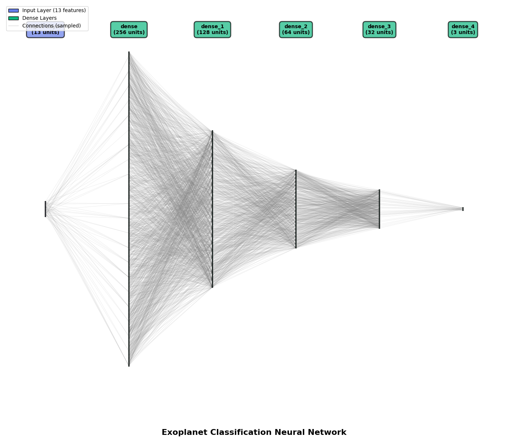
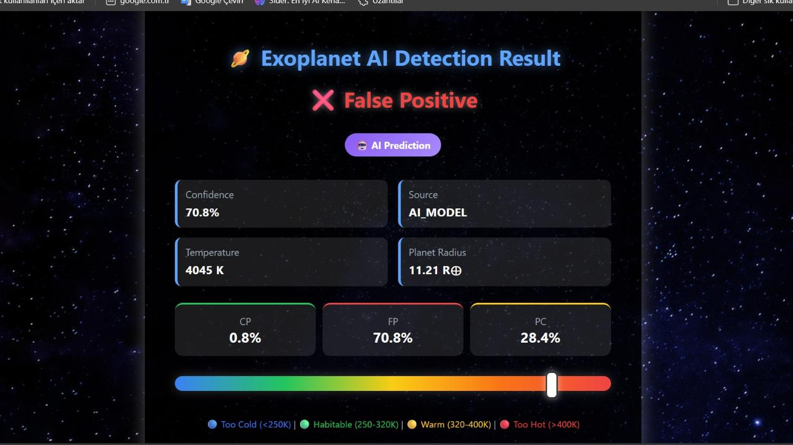
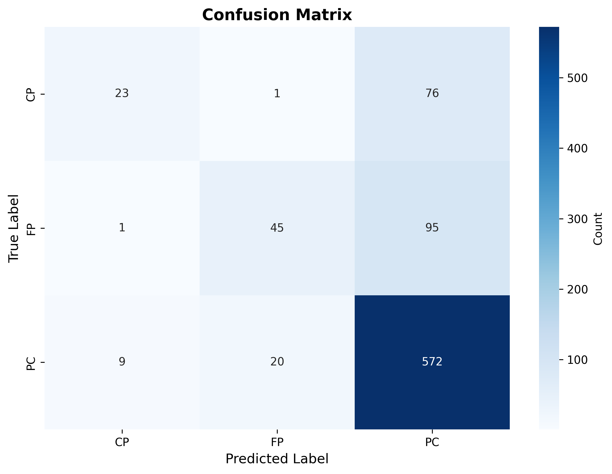
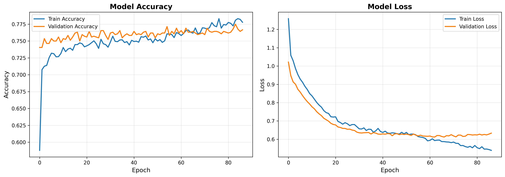
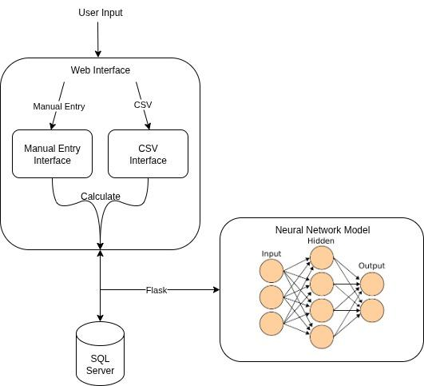

# AI-Based Exoplanet Classification System



## Summary
This project is a neural network-based exoplanet classification system designed and trained with NASA TESS mission data and categorize celestial objects as **Confirmed Planets (CP)**, **Planet Candidates (PC)**, or **False Positives (FP)**. It addresses the challenge of processing the massive backlog of TESS observations that would take astronomers days to review manually.

The system achieves over **78% classification accuracy** by training on more than 5,000 observations with 13 key astrophysical parameters. It uses a two-tier approach:  
1. **Database Verification:** Checks NASA's database using fuzzy matching (2% error margin) to identify known planets.  
2. **AI Classification:** Deploys the neural network model to classify new discoveries.

Users interact via a web interface, allowing single observation input or batch CSV uploads. Predictions include confidence scores, temperature analysis, and habitability assessments. The project accelerates exoplanet discovery, prioritizes promising candidates, and democratizes access to advanced AI analysis in astronomy.

**Demo:**  


**Results:**  
  
  

---

## Features
- High-accuracy exoplanet classification into CP, PC, or FP.  
- Two-tier system combining database verification and AI prediction.  
- Web interface for interactive predictions with single or batch inputs.  
- Confidence scoring, temperature analysis, and habitability assessment.  
- Fully automated pipeline for efficient handling of TESS data.

---

## Technology Stack
- **Programming Language:** Python  
- **Deep Learning:** TensorFlow/Keras  
- **Data Processing:** pandas, NumPy  
- **Web Framework:** Flask  
- **Database:** SQL Server (local storage of TESS data)  
- **Development Environment:** Jupyter Notebook  

The system was designed for end-to-end automation: user input → database check → neural network classification → prediction output.

---

## Methodology
1. **Data Preparation:** TESS mission dataset processed for 13 key astrophysical parameters.  
2. **Model Training:** Deep neural network trained on 5,000+ observations to classify CP, PC, and FP.  
3. **Prediction Pipeline:**  
   - Input observation(s) via web interface.  
   - Fuzzy match with local SQL Server database for known planets.  
   - Pass unmatched entries to neural network for classification.  
   - Display results with confidence, temperature, and habitability analysis.  
4. **Creativity:** Automates a historically manual process, increasing speed and consistency in exoplanet identification.

**Workflow:**  


---

## Requirements
Python packages:

TensorFlow==2.20.0

Keras==3.11.3

pandas==2.3.3

NumPy==2.3.3

Flask==3.1.3

scikit-learn==1.7.2

matplotlib==3.10.6

seaborn==0.13.2

can be installed via:

```bash
pip install -r requirements.txt
